# Heritage Housing Analysis

- A machine learning project that analyses residential property data and predicts house sale prices using a Gradient Boosting regression model. The project follows a complete data science workflow, including business understanding, data exploration, data cleaning, feature engineering, model comparison, model evaluation, and deployment through an interactive Streamlit dashboard.


### Live Application

The live Streamlit application can be accessed here:

[Heritage Housing Analysis Dashboard](https://ieva-heritage-housing-analysis-1e0ab3940ab0.herokuapp.com/)

---

## Table of Contents

- [Project Overview](#project-overview)
- [Business Problem](#business-problem)
- [Project Objectives](#project-objectives)
- [Project Hypotheses](#project-hypotheses)
- [Project Workflow (CRISP-DM)](#project-workflow-crisp-dm)
- [Exploratory Data Analysis](#exploratory-data-analysis)
- [Dataset Content](#dataset-content)
- [Business Requirements](#business-requirements)
- [Mapping Business Requirements to the Solution](#mapping-business-requirements-to-the-solution)
- [ML Business Case](#ml-business-case)
- [House Price Prediction](#house-price-prediction)
- [Model Evaluation](#model-evaluation)
- [Model Limitations](#model-limitations)
- [Recommendations for Future Development](#recommendations-for-future-development)
- [Conclusions](#conclusions)
- [Dashboard Design](#dashboard-design)
- [Testing](#testing)
- [Unfixed Bugs](#unfixed-bugs)
- [Repository](#repository)
- [Clone the Repository](#clone-the-repository)
- [Deployment](#deployment)
- [Main Data Analysis and Machine Learning Libraries](#main-data-analysis-and-machine-learning-libraries)
- [Credits](#credits)
- [Documentation and References](#documentation-and-references)
- [Acknowledgements](#acknowledgements)
- [License](#license)
- [Final Remarks](#final-remarks)

---

## Project Overview

- This project investigates the factors that influence residential property prices in Ames, Iowa. Using historical housing data, the project explores the relationships between house attributes and sale prices before developing a machine learning model capable of predicting the sale price of a property.

- This project was developed in response to a business scenario in which a client inherited four residential properties in Ames, Iowa. The objective is to understand which property characteristics influence sale price and to build a machine learning model capable of estimating property values.

---

##  Business Problem

- Buying and selling houses involves many factors that influence property value. Real estate companies and homeowners benefit from understanding which features have the greatest impact on sale prices.

-  The objective of this project is to build a machine learning model capable of predicting house sale prices based on property characteristics while identifying the most influential features affecting price.

---

##  Project Objectives

The project objectives were to:

- Understand the Ames Housing dataset.
- Clean and prepare the data for analysis.
- Engineer meaningful features to improve model performance.
- Train and compare multiple regression models.
- Select the strongest-performing model for deployment.
- Export the trained model for deployment.
- Build an interactive Streamlit dashboard for house price prediction.

---

##  Project Hypotheses

Before analysing the dataset, the following hypotheses were established:

The following hypotheses were investigated:

### Hypothesis 1

Houses with higher Overall Quality ratings achieve higher sale prices.

**Outcome:** Supported.

---

### Hypothesis 2

Larger living areas increase house sale prices.

**Outcome:** Supported.

---

### Hypothesis 3

Newer houses generally sell for higher prices.

**Outcome:** Partially supported.

---

### Hypothesis 4

The selected features provide sufficient information to build a reliable house price prediction model.

**Outcome:** Supported.

---

### Hypothesis 5

Garage size contributes positively to house value.

**Outcome:** Supported.


## Project Workflow (CRISP-DM)

This project follows the CRISP-DM methodology:

## 1. Business Understanding

Understanding the client's objective of estimating inherited property values.

## 2. Data Understanding

Exploring the Ames Housing dataset and identifying important variables.

## 3. Data Preparation

Cleaning missing values, encoding categorical variables, scaling features where appropriate, and engineering additional features.

## 4. Modelling

Training and comparing Linear Regression, Ridge Regression, Random Forest Regression, and Gradient Boosting Regression models.

## 5. Evaluation

Comparing model performance using training R², test R², cross-validation R², Mean Absolute Error, and Root Mean Squared Error.

## 6. Deployment

Deploying the trained model within a Streamlit dashboard.

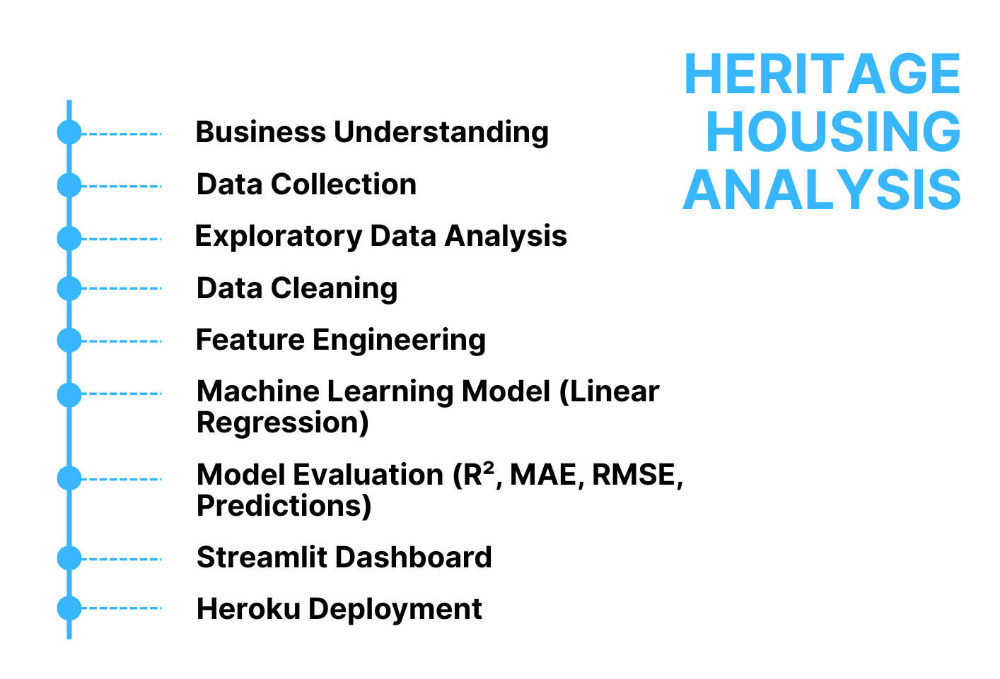

## Exploratory Data Analysis

The exploratory analysis was conducted to better understand the housing dataset, identify important relationships between variables, and guide the feature engineering and modelling process.

### Dataset Preview

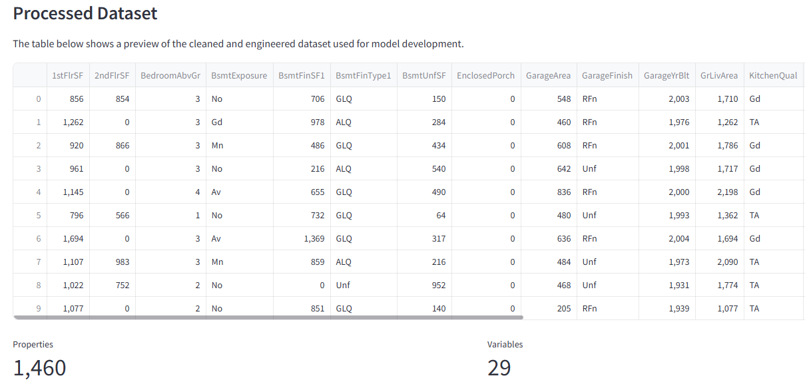

The cleaned and engineered dataset contains 1,460 observations and 24 variables used during model development.

---

### Sale Price Distribution

The distribution of house sale prices is positively skewed, indicating that most houses are sold within a moderate price range while relatively few high-value properties create a long right tail.

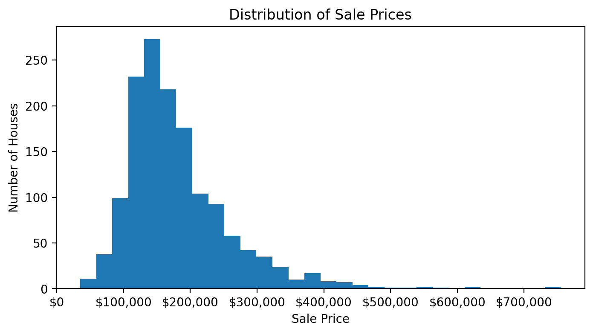

---

### Correlation Analysis

A correlation heatmap was created to examine relationships between numerical variables. Strong positive correlations can be observed between SalePrice and variables such as OverallQual, GrLivArea, GarageArea and TotalBsmtSF.

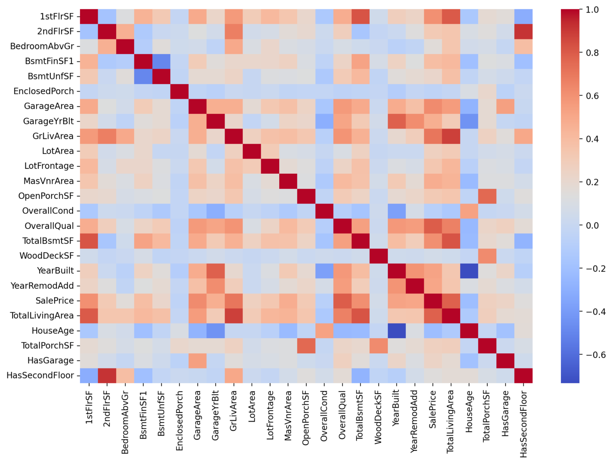

The chart below highlights the ten variables with the strongest correlation to SalePrice.

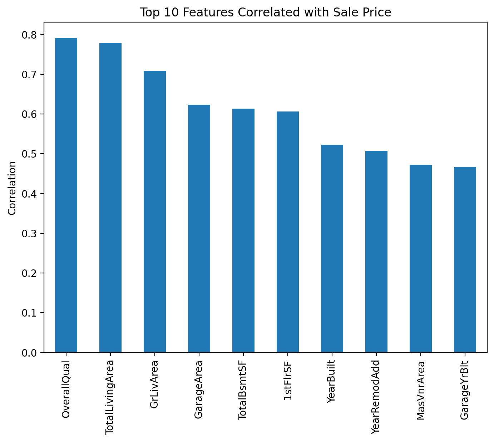

### Visualisations Used

- The exploratory data analysis used several types of visualisations to understand the dataset and investigate relationships between property features and sale price.

| Visualisation | Purpose |
|---------------|---------|
| Histogram | Examined the distribution of house sale prices and identified right-skewness. |
| Correlation Heatmap | Identified relationships between numerical variables and SalePrice. |
| Scatter Plots | Explored relationships between key numerical features (e.g. GrLivArea, YearBuilt, OverallQual) and sale price. |
| Correlation Ranking Plot | Highlighted the variables with the strongest correlation to SalePrice. |
| Actual vs Predicted Scatter Plot | Compared predicted house prices with actual sale prices to evaluate model performance. |
---

## Dataset Content

### Dataset Source

The dataset used in this project is the **Ames Housing Dataset**, sourced from [Kaggle](https://www.kaggle.com/codeinstitute/housing-prices-data). It contains historical residential property sales from **Ames, Iowa (USA)** between **1872 and 2010**.

This dataset was selected because it contains a wide range of house characteristics, making it suitable for developing a supervised machine learning model capable of predicting residential property sale prices.

---

### Dataset Summary

| Property | Description |
|-----------|-------------|
| Dataset | Ames Housing Dataset |
| Source | Kaggle |
| Problem Type | Supervised Machine Learning (Regression) |
| Target Variable | **SalePrice** |
| Number of Records | 1,460 Houses |
| Original Features | 80 Variables |
| Objective | Predict the sale price of residential properties |

---

### Project Objective

The objective of this project is to build a machine learning model capable of estimating the market value of residential properties based on their physical characteristics and overall quality.

The model analyses historical house sales to identify patterns between property features and selling prices, providing accurate price predictions for unseen properties.

---

### Feature Categories

To improve readability, the dataset variables can be grouped into the following categories:

| Category | Example Features |
|-----------|------------------|
| Property Size | GrLivArea, LotArea, TotalBsmtSF |
| House Quality | OverallQual, OverallCond |
| Construction | YearBuilt, YearRemodAdd |
| Garage | GarageArea, GarageCars |
| Basement | BsmtFinSF1, BsmtExposure |
| Rooms | BedroomAbvGr, FullBath, KitchenAbvGr |
| Exterior Features | WoodDeckSF, OpenPorchSF |
| Location | Neighborhood, MSZoning |

---

### Features Used for Prediction

Although the original dataset contains 80 variables, only the most relevant features were selected during the machine learning process to improve prediction accuracy.

Some of the most influential features include:

|Feature|Description|
|-------|-----------|
|OverallQual|Overall material and finish quality|
|GrLivArea|Above-ground living area (sq ft)|
|GarageCars|Number of garage spaces|
|GarageArea|Garage size (sq ft)|
|TotalBsmtSF|Total basement area (sq ft)|
|YearBuilt|Year the property was built|
|YearRemodAdd|Year of last renovation|
|FullBath|Number of full bathrooms|
|TotRmsAbvGrd|Total rooms above ground|
|1stFlrSF|First floor living area (sq ft)|

 **Note:** The final set of features used by the model was selected after data exploration, feature engineering and model evaluation.

---

### Data Preparation

Before training the machine learning model, the dataset underwent several preprocessing steps:

- Checked for duplicate records.
- Handled missing values.
- Converted categorical variables where required.
- Selected the most informative features.
- Performed feature engineering where appropriate.
- Split the dataset into training and testing datasets.
- Applied preprocessing within the machine learning pipeline to ensure consistent predictions.

---

### Why These Features?

Exploratory Data Analysis (EDA) showed that variables describing **property size**, **overall quality**, **garage capacity**, **basement area**, and **construction year** have the strongest relationship with house sale prices.

By focusing on these variables, the model is able to provide accurate and reliable predictions while reducing unnecessary complexity.

---

## Business Requirements

As a good friend, you are requested by your friend, who has received an inheritance from a deceased great-grandfather located in Ames, Iowa, to  help in maximising the sales price for the inherited properties.

Although your friend has an excellent understanding of property prices in her own state and residential area, she fears that basing her estimates for property worth on her current knowledge might lead to inaccurate appraisals. What makes a house desirable and valuable where she comes from might not be the same in Ames, Iowa. She found a public dataset with house prices for Ames, Iowa, and will provide you with that.

* 1 - The client is interested in discovering how the house attributes correlate with the sale price. Therefore, the client expects data visualisations of the correlated variables against the sale price to show that.

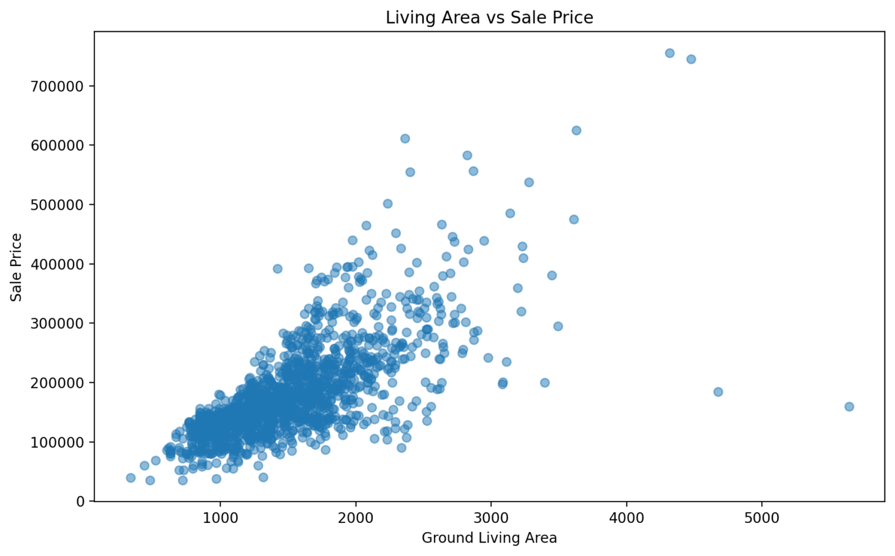

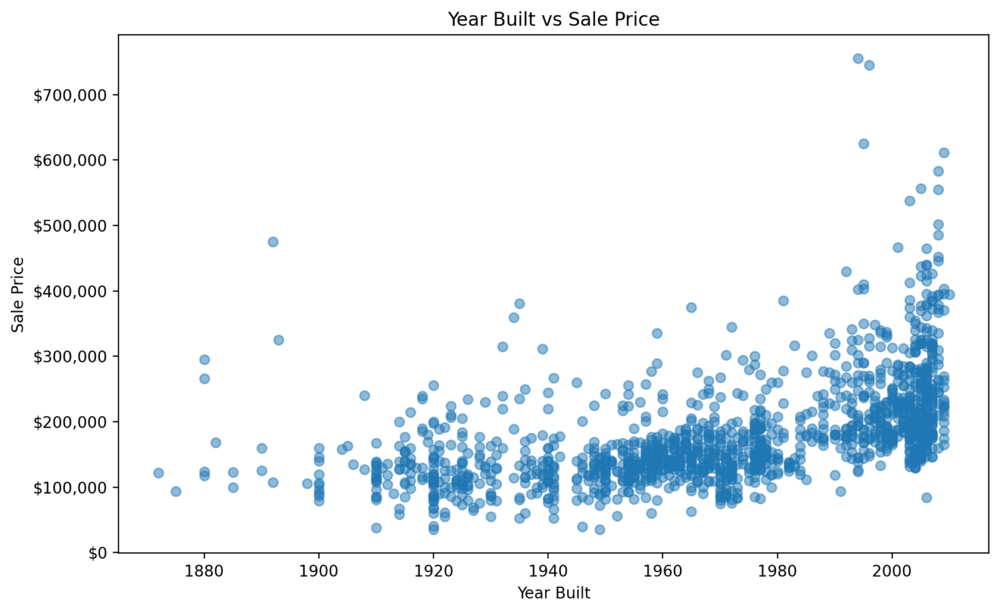

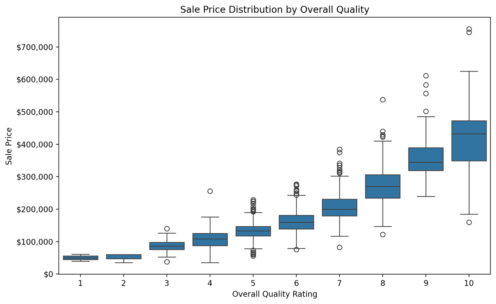

* 2 - The client is interested in predicting the house sale price from her four inherited houses and any other house in Ames, Iowa.

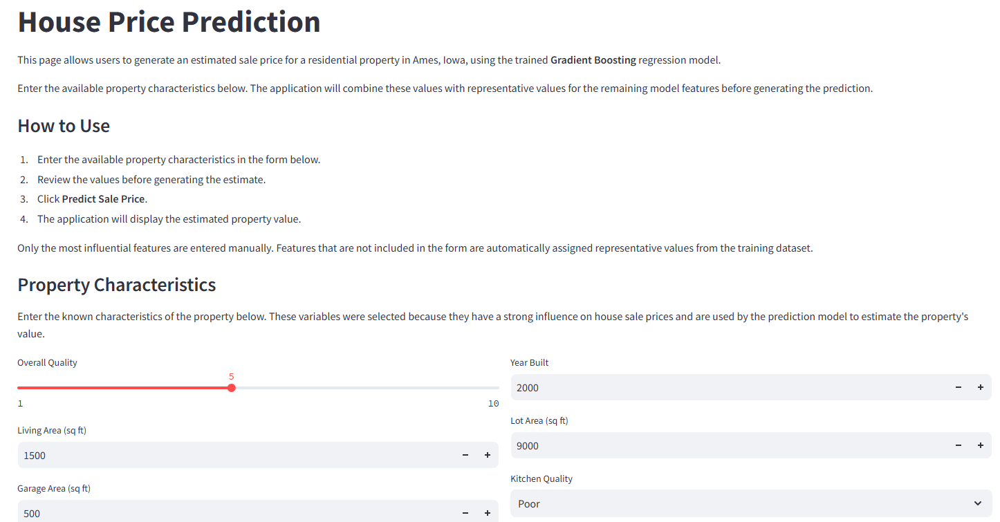

The project addresses the following business requirements:

- Analyse the Ames Housing dataset to identify the factors that most strongly influence house sale prices.
- Investigate relationships between house characteristics and sale price through exploratory data analysis.
- Develop a machine learning model capable of predicting house sale prices from property characteristics.
- Create an interactive dashboard that allows users to explore the dataset, review the model performance, and generate estimated sale prices for individual properties.

---

## Mapping Business Requirements to the Solution

### Business Requirement 1

Identify which house characteristics have the strongest relationship with sale price.

**Approach**

- Performed exploratory data analysis.
- Generated correlation heatmaps.
- Analysed feature correlations with SalePrice.
- Visualised the distribution of sale prices.

### Business Requirement 2

Predict the sale price of inherited houses and other properties.

**Approach**

- Cleaned and prepared the dataset.
- Engineered additional predictive features.
- Trained, compared, and evaluated multiple regression models before selecting Gradient Boosting Regression as the final deployment model.

---

## ML Business Case

- The business objective of this project is to support the client in estimating realistic sale prices for residential properties located in Ames, Iowa.

- This problem is formulated as a **supervised machine learning regression task**, where the model learns the relationship between house characteristics and the corresponding sale price from historical data.


### Inputs

The model uses property characteristics such as:

* Overall quality
* Ground living area
* Basement area
* Garage size
* Lot size
* Year built
* Porch and deck areas
* Kitchen quality
* Additional engineered features created during data preparation

### Target

The target variable is **SalePrice**, representing the final selling price of each property.

### Success Criteria

The project was considered successful if the selected predictive model achieved an R² score greater than **0.75** on unseen test data.

The final Gradient Boosting regression model achieved:

- Test R²: **0.8892**
- Cross-validation R²: **0.8607**
- Mean Absolute Error: **$17,953.97**
- Root Mean Squared Error: **$29,149.13**

The model exceeded the project success criterion, demonstrating that the selected original and engineered features provide a reliable basis for predicting residential property sale prices.

---

## House Price Prediction

The Streamlit dashboard allows users to enter six important property characteristics:

- Overall quality
- Above-ground living area
- Garage area
- Year built
- Lot area
- Kitchen quality

The trained Gradient Boosting regression model uses these values to estimate the property's sale price.

Only the most influential and understandable characteristics are entered manually. Features not included in the form are automatically assigned representative median values from the processed training dataset.

The application also updates relevant engineered features, such as whether the property has a garage, before generating the prediction.

Predictions should be interpreted as estimates rather than professional property valuations. The selected model achieved a test R² score of **0.8892** and a Mean Absolute Error of approximately **$17,954** on unseen test data.

---

## Model Evaluation


Four regression algorithms were trained and evaluated:

- Linear Regression
- Ridge Regression
- Random Forest Regression
- Gradient Boosting Regression

The models were compared using training R², test R², cross-validation R², Mean Absolute Error, and Root Mean Squared Error.

Gradient Boosting Regression achieved the strongest overall performance and was selected as the final deployed model.

| Metric | Result |
|---|---:|
| Training R² | 0.9633 |
| Test R² | 0.8892 |
| Cross-validation R² | 0.8607 |
| Mean Absolute Error | $17,953.97 |
| Root Mean Squared Error | $29,149.13 |

The test R² score indicates that the model explains approximately **88.9% of the variation in house sale prices** within the unseen test data.

The Mean Absolute Error indicates that predicted sale prices differ from actual sale prices by approximately **$17,954 on average**.

The training R² score is higher than the test R² score, suggesting a small amount of overfitting. However, the strong cross-validation score demonstrates that the model performs consistently across different subsets of the dataset.

Overall, the Gradient Boosting model provides strong predictive performance and suitable generalisation for estimating the sale prices of unseen properties.

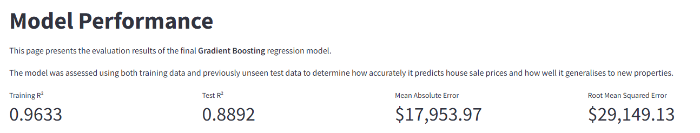

### Actual vs Predicted Sale Prices

- The scatter plot compares the model's predicted sale prices with the actual values from the test dataset. Most observations lie close to the diagonal reference line, indicating that the Gradient Boosting Regression model predicts house prices with good overall accuracy. Larger deviations occur mainly for the highest-priced properties, showing that the model is less accurate for extreme values.

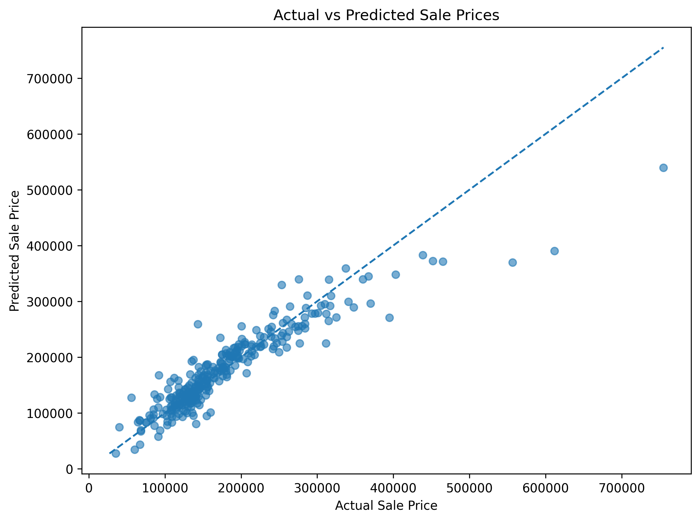

---

## Model Limitations

Although the selected Gradient Boosting model achieved strong predictive performance, it has several limitations:

- The model was trained using historical housing data from Ames, Iowa and may not generalise to other locations.
- Historical property values may not represent current or future housing-market conditions.
- Some unusual, luxury, or high-value properties may be more difficult to predict accurately.
- The Streamlit prediction form collects six selected property characteristics, while the remaining model inputs are assigned representative median values.
- Using median values for unspecified characteristics means the prediction may not fully represent every individual property.
- The prediction should be treated as an estimate rather than a professional property valuation.

---

## Recommendations for Future Development

Future versions of the project could:

- Expand the prediction form to include additional property characteristics.
- Use a complete preprocessing and prediction pipeline to simplify deployment.
- Perform hyperparameter optimisation for the selected Gradient Boosting model.
- Investigate additional algorithms such as XGBoost or LightGBM.
- Analyse model feature importance in greater detail.
- Investigate transformations of the `SalePrice` target variable.
- Add prediction intervals to communicate uncertainty.
- Retrain the model using more recent property-market data.
- Extend the model to other geographical locations.

---

## Conclusions

This project successfully developed an end-to-end machine learning solution for predicting house sale prices in Ames, Iowa.

Exploratory data analysis showed that overall quality, above-ground living area, garage characteristics, total-area features, and construction year are important indicators of sale price.

Four regression algorithms were trained and evaluated during model development. Through this iterative evaluation process, Gradient Boosting Regression demonstrated the best balance of predictive accuracy and generalisation and was therefore selected as the final model for deployment.

The final model achieved:

- Training R²: **0.9633**
- Test R²: **0.8892**
- Cross-validation R²: **0.8607**
- Mean Absolute Error: **$17,953.97**
- Root Mean Squared Error: **$29,149.13**

The model exceeded the project success criterion of R² greater than 0.75 and demonstrated strong performance on unseen data.

Both business requirements were addressed through exploratory analysis, feature engineering, model comparison, evaluation, and deployment within an interactive Streamlit dashboard.

### Hypothesis Validation

| Hypothesis | Result |
|------------|--------|
| Houses with higher Overall Quality ratings achieve higher sale prices. | Supported |
| Larger living areas increase house sale prices. | Supported |
| Newer houses generally sell for higher prices. | Partially supported |
| The selected features provide sufficient information to build a reliable house price prediction model.  | Supported |
| Garage size contributes positively to house value. | Supported |

---

## Dashboard Design

The Streamlit dashboard is organised into five pages that guide the user through the project, from understanding the business problem to generating house price predictions.

### Project Overview

The Project Overview page introduces the purpose of the project, outlines the business scenario, and provides an overview of the dashboard. It also displays the navigation menu, allowing users to move easily between each section of the application.

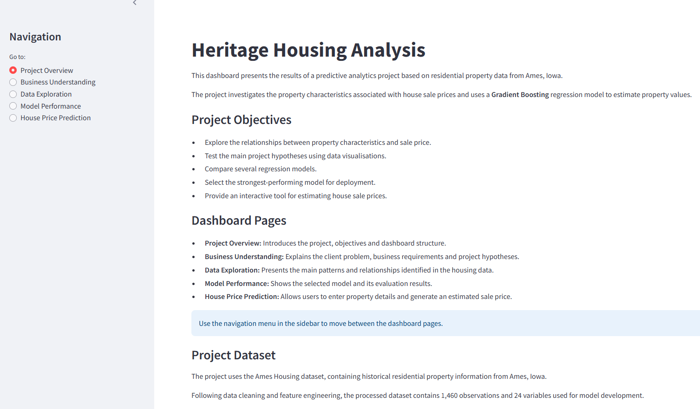

The introduction section summarises the project objectives and the machine learning approach used to estimate house sale prices.

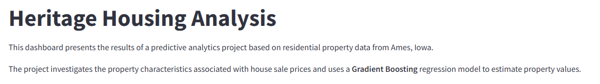

### Business Understanding

The Business Understanding page explains the client's requirements, presents the project hypotheses, and summarises whether each hypothesis was supported after analysing the dataset.

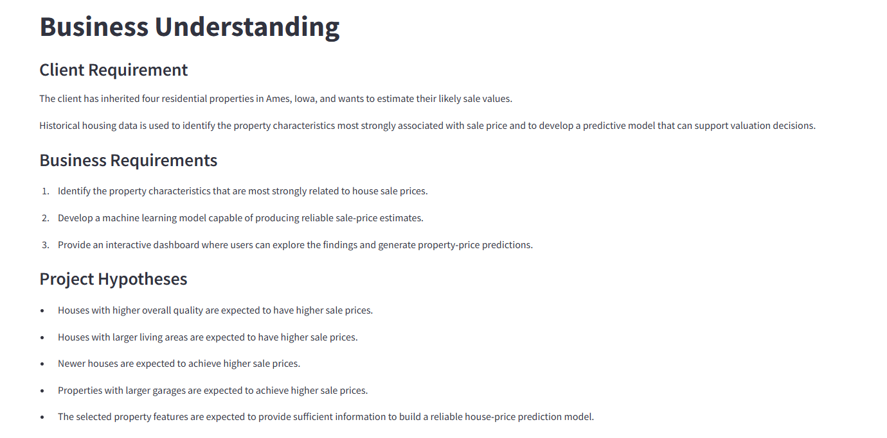

### Data Exploration

The Data Exploration page presents the processed dataset together with the key visualisations used to understand the data and identify relationships between property characteristics and sale price.

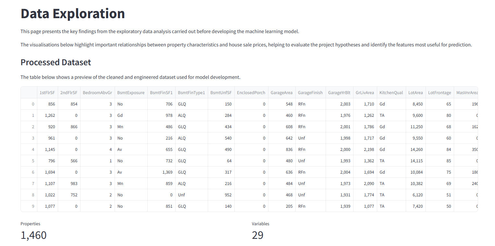

### Model Performance

The Model Performance page compares the trained regression models, presents the evaluation metrics for the selected Gradient Boosting model, and explains why it was chosen for deployment.

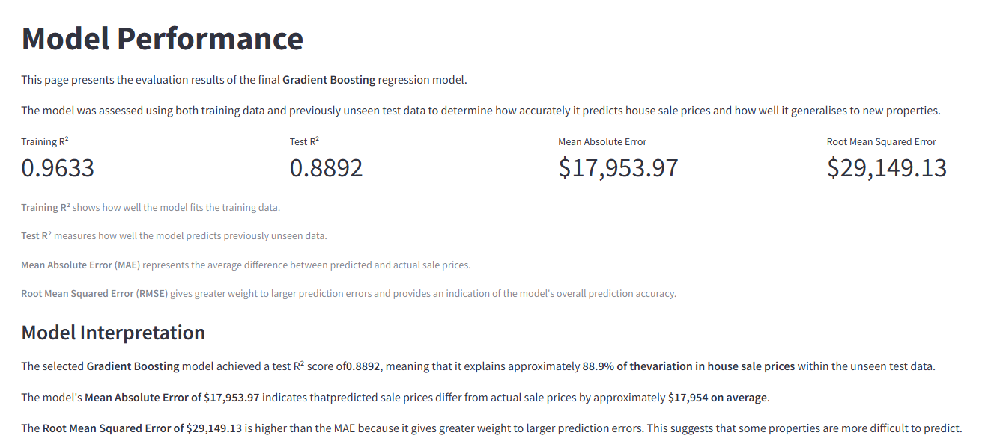

### House Price Prediction

The House Price Prediction page allows users to enter key property characteristics and generate an estimated sale price using the trained Gradient Boosting regression model.


After entering the property information and clicking **Predict Sale Price**, the dashboard displays the estimated market value.

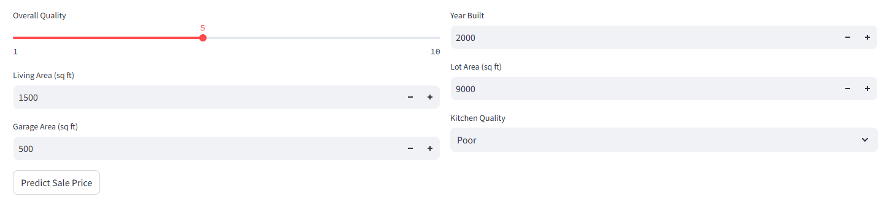

---

## Testing

Testing was carried out throughout the project to confirm that the notebooks, dashboard, prediction functionality, and deployment files behaved as expected.

### Notebook Testing

| Test | Expected Result | Outcome |
|---|---|---|
| Notebook 1: Business Understanding | Opens correctly and contains the business requirements and hypotheses | Pass |
| Notebook 2: Data Collection and Exploration | Dataset loads and exploratory analysis runs without errors | Pass |
| Notebook 3: Data Cleaning | Missing values are handled and the cleaned dataset is saved | Pass |
| Notebook 4: Feature Engineering | Engineered features are created and the dataset is saved successfully | Pass |
| Notebook 5: Modelling and Evaluation | Model trains, evaluates, produces predictions, and exports successfully | Pass |

### Dashboard Testing

| Feature | Expected Result | Outcome |
|---|---|---|
| Sidebar navigation | Each dashboard page opens correctly | Pass |
| Project Overview page | Project summary displays correctly | Pass |
| Business Understanding page | Business problem, hypotheses, and validation results display correctly | Pass |
| Data Exploration page | Dataset preview and all visualisations display correctly | Pass |
| Model Performance page | MAE, RMSE, and R² metrics display correctly | Pass |
| Prediction page | User inputs are accepted and an estimated sale price is returned | Pass |
| Prediction result | Changing input values changes the predicted sale price | Pass |
| Model loading | Saved model and feature list load without errors | Pass |

#### Dashboard Verification

The Streamlit dashboard was tested locally to verify that each page loaded correctly, navigation functioned as expected, visualisations were displayed without errors, and house price predictions were successfully generated.

**Project Overview**


**Model Performance**


**Prediction Result**


---

### Input Testing

| Test | Expected Result | Outcome |
|---|---|---|
| Minimum allowed values | Prediction is returned without an error | Pass |
| Typical property values | Prediction is returned and appears reasonable | Pass |
| Maximum allowed values | Prediction is returned without an error | Pass |
| Kitchen quality options | Each dropdown option can be selected | Pass |
| Garage area set to zero | Prediction runs and `HasGarage` is treated as false | Pass |

### Code and Environment Testing

| Test | Expected Result | Outcome |
|---|---|---|
| `requirements.txt` installation | All required packages install successfully | Pass |
| Streamlit local launch | App starts with `streamlit run app.py` |  Pass |
| Model files | `.pkl` files exist and are readable | Pass |
| Git repository | No virtual environment or temporary files are committed | Pass |
| Notebook execution | Notebooks run from top to bottom after restarting the kernel | Pass |
| Flake8 validation | `python -m flake8 app.py` completes without reporting errors | Pass |

### Code Validation

- The Python code used in this project was validated using the Code Institute Python Linter to ensure compliance with PEP 8 coding standards.

- The main application file `app.py` was tested and successfully passed the validation with **no errors found**, confirming that the code follows the recommended Python style guidelines.

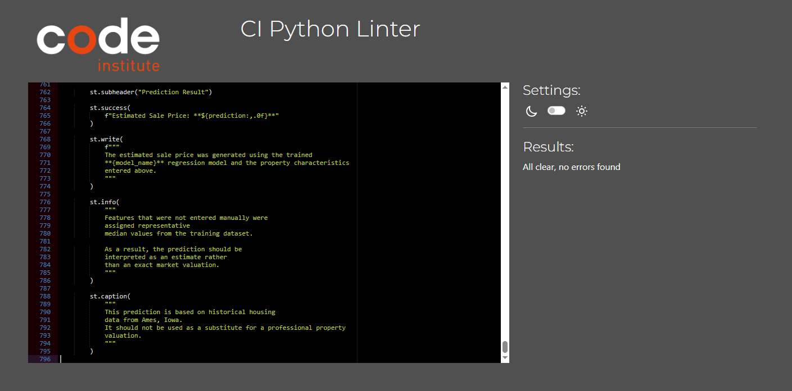

### Code Quality

The project was checked using **Flake8** to verify that the Python code follows standard style guidelines.

The final version of the application completed the Flake8 checks without reporting any errors.


### Known Testing Limitations

- Predictions are estimates based on historical Ames Housing data and should not be considered professional property valuations.
- The dashboard uses six user-entered features while the remaining model inputs are assigned typical values from the training dataset.

---

## Unfixed Bugs

- At the time of writing, no known critical bugs affect the functionality of the notebooks, dashboard, or prediction system.

- The application loads the exported model successfully, all dashboard pages display correctly, and house price predictions can be generated from the user inputs.

The following items are considered future enhancements rather than unresolved bugs:

- Expanding the prediction form with additional property features.
- Further tuning the Gradient Boosting model.
- Adding feature-importance visualisations.
- Adding prediction intervals to communicate uncertainty.

---

## Repository

The source code for this project is available on GitHub:

[GitHub Repository](https://github.com/liepinaievaa-maker/heritage-housing-analysis)

---

## Clone the Repository

To clone this repository to your local machine:

1. Open your terminal or Git Bash.
2. Navigate to the directory where you would like to store the project.
3. Run the following command:

```bash
git clone https://github.com/liepinaievaa-maker/heritage-housing-analysis.git
```

4. Move into the project folder:

```bash
cd heritage-housing-analysis
```

5. (Optional) Create and activate a virtual environment before installing the project requirements.

6. Install the required dependencies:

```bash
pip install -r requirements.txt
```

7. Start the Streamlit application:

```bash
streamlit run app.py
```

---

## Deployment

### Heroku

- The live application can be accessed here:
[Heritage Housing Analysis Dashboard](https://ieva-heritage-housing-analysis-1e0ab3940ab0.herokuapp.com/) 

The project was deployed to Heroku using the following steps:

1. Created a new application in Heroku.
2. Selected **GitHub** as the deployment method.
3. Connected the Heroku application to the GitHub repository:
[Heritage Housing Analysis Repository](https://github.com/liepinaievaa-maker/heritage-housing-analysis)
4. Selected the **main** branch.
5. Clicked **Deploy Branch** to build and deploy the application.
6. Once the deployment completed successfully, the application was launched using the **Open App** button.
7. Any further changes pushed to the `main` branch can be redeployed through Heroku.

### Deployment Requirements

The application requires the following deployment files:

- `requirements.txt` – lists all required Python packages.
- `Procfile` – specifies the command used to run the Streamlit application.
- `.python-version` – specifies the Python version used by Heroku.
- `.slugignore` – excludes unnecessary files from the deployment to reduce the slug size.

During deployment, packages that were only required for exploratory data analysis (such as `ydata-profiling`, `yellowbrick`, and `ppscore`) were excluded from the deployed application because they were not required for running the Streamlit dashboard. This reduced the deployment size and allowed the application to deploy successfully.

---

## Main Data Analysis and Machine Learning Libraries

Main Libraries Used: 

### Pandas
- Pandas was used throughout the project for loading, cleaning, transforming, and analysing the housing dataset. It was also used to manipulate DataFrames, handle missing values, and prepare the data for modelling.

### NumPy
- NumPy was used for numerical computations, array operations, and supporting preprocessing tasks during feature engineering and model evaluation.

### Matplotlib
- Matplotlib was used to create static visualisations, including scatter plots, histograms, and model evaluation charts displayed in both the notebooks and the Streamlit dashboard.

### Seaborn
- Seaborn was used to create higher-level statistical visualisations, including the correlation heatmap and boxplots that supported the exploratory data analysis.

### Scikit-learn
- Scikit-learn was used to split the dataset into training and testing sets, preprocess model features, train and compare Linear Regression, Ridge Regression, Random Forest Regression, and Gradient Boosting Regression models, perform cross-validation, and evaluate model performance using MAE, RMSE, and R².

### Joblib
- Joblib was used to save and load the selected Gradient Boosting regression model, the model feature list, and the model name required by the Streamlit dashboard.

### Streamlit
- Streamlit was used to develop the interactive dashboard, allowing users to explore the dataset, review the model performance, and generate house price predictions.

---

## Credits

### Dataset

- Code Institute Heritage Housing dataset
- Ames Housing Dataset provided through the Code Institute Predictive Analytics course.

### Learning Resources

- Code Institute Predictive Analytics Walkthrough Project
- [Code Institute Heritage Housing Walkthrough Repository](https://github.com/Code-Institute-Solutions/milestone-project-heritage-housing-issues)
- Code Institute LMS
- Scikit-learn Documentation
- Streamlit Documentation
- Pandas Documentation
- Matplotlib Documentation
- Seaborn Documentation

### Tools Used

The following tools were used during development:

- Git & GitHub
- Visual Studio Code
- Jupyter Notebook
- Streamlit
- Heroku
- Canva (workflow diagram)

## Documentation and References

The following official documentation resources were consulted during development:

- [Pandas Documentation](https://pandas.pydata.org/docs/)

- [NumPy Documentation](https://numpy.org/doc/)

- [Matplotlib Documentation](https://matplotlib.org/stable/)

- [Seaborn Documentation](https://seaborn.pydata.org/)

- [Scikit-learn Documentation](https://scikit-learn.org/stable/)

- [Streamlit Documentation](https://docs.streamlit.io/)

- [Joblib Documentation](https://joblib.readthedocs.io/)

### Design Resources

- Workflow diagram and application mockup were created using [Canva](https://www.canva.com/)

### Acknowledgements

This project was completed as part of the Code Institute Predictive Analytics programme.

The Code Institute Heritage Housing walkthrough project provided valuable guidance for understanding the end-to-end machine learning workflow, including data exploration, preprocessing, model development, evaluation, and deployment.

While inspired by the walkthrough structure, this project includes my own exploratory data analysis, model comparison, Streamlit dashboard implementation, documentation, and project organisation.

---

## License

- This project was created for educational purposes as part of the Code Institute Predictive Analytics programme.

---

## Final Remarks

- This project demonstrates the complete development of a machine learning solution, from understanding the business problem and preparing the data to training, evaluating, and deploying a predictive model.

The interactive Streamlit dashboard enables users to explore the analysis, review model performance, and estimate residential property sale prices using the trained Gradient Boosting regression model.