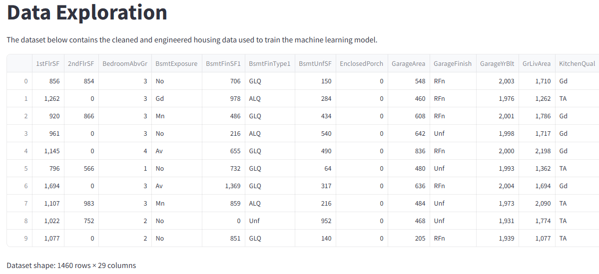
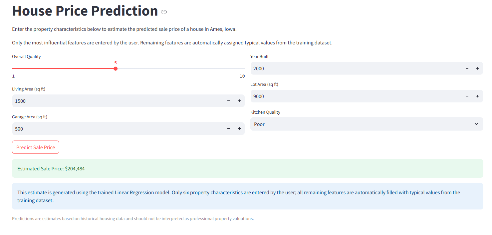
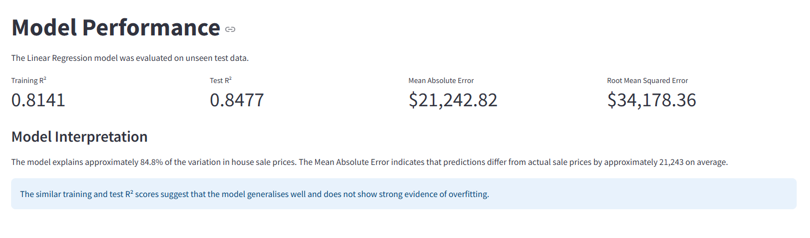

//** Moc **//

# Heritage Housing Analysis

- A machine learning project that analyzes residential property data and predicts house sale prices using Linear Regression. The project follows a complete data science workflow, including business understanding, data exploration, data cleaning, feature engineering, model training, and evaluation.

## Table of Contents

- [Project Overview](#project-overview)
- [Business Problem](#business-problem)
- [Project Objectives](#project-objectives)
- [Project Hypotheses](#project-hypotheses)
- [Project Workflow (CRISP-DM)](#project-workflow-crisp-dm)
- [Exploratory Data Analysis](#exploratory-data-analysis)
- [Dataset Content](#dataset-content)
- [Business Requirements](#business-requirements)
- [Mapping Business Requirements to the Solution](#mapping-business-requirements-to-the-solution)
- [ML Business Case](#ml-business-case)
- [House Price Prediction](#house-price-prediction)
- [Model Evaluation](#model-evaluation)
- [Model Limitations](#model-limitations)
- [Recommendations for Future Development](#recommendations-for-future-development)
- [Conclusions](#conclusions)
- [Dashboard Design](#dashboard-design)
- [Testing](#testing)
- [Unfixed Bugs](#unfixed-bugs)
- [Deployment](#deployment)
- [Main Data Analysis and Machine Learning Libraries](#main-data-analysis-and-machine-learning-libraries)
- [Credits](#credits)
- [Documentation and References](#documentation-and-references)
- [Acknowledgements](#acknowledgements)

## Project Overview

- This project investigates the factors that influence residential property prices in Ames, Iowa. Using historical housing data, the project explores the relationships between house attributes and sale prices before developing a machine learning model capable of predicting the sale price of a property.

- This project was developed in response to a business scenario in which a client inherited four residential properties in Ames, Iowa. The objective is to understand which property characteristics influence sale price and to build a machine learning model capable of estimating property values.

##  Business Problem

- Buying and selling houses involves many factors that influence property value. Real estate companies and homeowners benefit from understanding which features have the greatest impact on sale prices.

-  The objective of this project is to build a machine learning model capable of predicting house sale prices based on property characteristics while identifying the most influential features affecting price.

##  Project Objectives

The objectives of this project were to:

- Understand the Ames Housing dataset.
- Clean and prepare the data for analysis.
- Engineer meaningful features to improve model performance.
- Train and evaluate a Linear Regression model.
- Export the trained model for deployment.
- Build an interactive Streamlit dashboard for house price prediction.

##  Project Hypotheses

Before analysing the dataset, the following hypotheses were established:

The following hypotheses were investigated:

### Hypothesis 1

Houses with higher Overall Quality ratings achieve higher sale prices.

**Outcome:** Supported.

---

### Hypothesis 2

Larger living areas increase house sale prices.

**Outcome:** Supported.

---

### Hypothesis 3

Newer houses generally sell for higher prices.

**Outcome:** Partially supported.

---

### Hypothesis 4

The selected features provide sufficient information to build a reliable house price prediction model.

**Outcome:** Supported.

---

### Hypothesis 5

Garage size contributes positively to house value.

**Outcome:** Supported.

## Project Workflow (CRISP-DM)

This project follows the CRISP-DM methodology:

## 1. Business Understanding

Understanding the client's objective of estimating inherited property values.

## 2. Data Understanding

Exploring the Ames Housing dataset and identifying important variables.

## 3. Data Preparation

Cleaning missing values, encoding categorical variables, scaling features where appropriate, and engineering additional features.

## 4. Modelling

Training and evaluating a Linear Regression model.

## 5. Evaluation

Assessing model performance using MAE, RMSE, R² score, and prediction visualisations.

## 6. Deployment

Deploying the trained model within a Streamlit dashboard.

## Exploratory Data Analysis

The exploratory analysis was conducted to better understand the housing dataset, identify important relationships between variables, and guide the feature engineering and modelling process.

### Dataset Preview

The cleaned dataset contains 1,460 observations and 29 engineered features used to train the prediction model.

---

### Sale Price Distribution

The distribution of house sale prices is positively skewed, indicating that most houses are sold within a moderate price range while relatively few high-value properties create a long right tail.

---

### Correlation Analysis

A correlation heatmap was created to examine relationships between numerical variables. Strong positive correlations can be observed between SalePrice and variables such as OverallQual, GrLivArea, GarageArea and TotalBsmtSF.

The chart below highlights the ten variables with the strongest correlation to SalePrice.

## Dataset Content

### Dataset Source

The dataset used in this project is the **Ames Housing Dataset**, sourced from [Kaggle](https://www.kaggle.com/codeinstitute/housing-prices-data). It contains historical residential property sales from **Ames, Iowa (USA)** between **1872 and 2010**.

This dataset was selected because it contains a wide range of house characteristics, making it suitable for developing a supervised machine learning model capable of predicting residential property sale prices.

---

### Dataset Summary

| Property | Description |
|-----------|-------------|
| Dataset | Ames Housing Dataset |
| Source | Kaggle |
| Problem Type | Supervised Machine Learning (Regression) |
| Target Variable | **SalePrice** |
| Number of Records | 1,460 Houses |
| Original Features | 80 Variables |
| Objective | Predict the sale price of residential properties |

---

### Project Objective

The objective of this project is to build a machine learning model capable of estimating the market value of residential properties based on their physical characteristics and overall quality.

The model analyses historical house sales to identify patterns between property features and selling prices, providing accurate price predictions for unseen properties.

---

### Feature Categories

To improve readability, the dataset variables can be grouped into the following categories:

| Category | Example Features |
|-----------|------------------|
| Property Size | GrLivArea, LotArea, TotalBsmtSF |
| House Quality | OverallQual, OverallCond |
| Construction | YearBuilt, YearRemodAdd |
| Garage | GarageArea, GarageCars |
| Basement | BsmtFinSF1, BsmtExposure |
| Rooms | BedroomAbvGr, FullBath, KitchenAbvGr |
| Exterior Features | WoodDeckSF, OpenPorchSF |
| Location | Neighborhood, MSZoning |

---

### Features Used for Prediction

Although the original dataset contains 80 variables, only the most relevant features were selected during the machine learning process to improve prediction accuracy.

Some of the most influential features include:

|Feature|Description|
|-------|-----------|
|OverallQual|Overall material and finish quality|
|GrLivArea|Above-ground living area (sq ft)|
|GarageCars|Number of garage spaces|
|GarageArea|Garage size (sq ft)|
|TotalBsmtSF|Total basement area (sq ft)|
|YearBuilt|Year the property was built|
|YearRemodAdd|Year of last renovation|
|FullBath|Number of full bathrooms|
|TotRmsAbvGrd|Total rooms above ground|
|1stFlrSF|First floor living area (sq ft)|

 **Note:** The final set of features used by the model was selected after data exploration, feature engineering and model evaluation.

---

### Data Preparation

Before training the machine learning model, the dataset underwent several preprocessing steps:

- Checked for duplicate records.
- Handled missing values.
- Converted categorical variables where required.
- Selected the most informative features.
- Performed feature engineering where appropriate.
- Split the dataset into training and testing datasets.
- Applied preprocessing within the machine learning pipeline to ensure consistent predictions.

---

### Why These Features?

Exploratory Data Analysis (EDA) showed that variables describing **property size**, **overall quality**, **garage capacity**, **basement area**, and **construction year** have the strongest relationship with house sale prices.

By focusing on these variables, the model is able to provide accurate and reliable predictions while reducing unnecessary complexity.

---

## Business Requirements

As a good friend, you are requested by your friend, who has received an inheritance from a deceased great-grandfather located in Ames, Iowa, to  help in maximising the sales price for the inherited properties.

Although your friend has an excellent understanding of property prices in her own state and residential area, she fears that basing her estimates for property worth on her current knowledge might lead to inaccurate appraisals. What makes a house desirable and valuable where she comes from might not be the same in Ames, Iowa. She found a public dataset with house prices for Ames, Iowa, and will provide you with that.

* 1 - The client is interested in discovering how the house attributes correlate with the sale price. Therefore, the client expects data visualisations of the correlated variables against the sale price to show that.

* 2 - The client is interested in predicting the house sale price from her four inherited houses and any other house in Ames, Iowa.

The project addresses the following business requirements:

- Analyse the Ames Housing dataset to identify the factors that most strongly influence house sale prices.
- Investigate relationships between house characteristics and sale price through exploratory data analysis.
- Develop a machine learning model capable of predicting house sale prices from property characteristics.
- Create an interactive dashboard that allows users to explore the dataset, review the model performance, and generate estimated sale prices for individual properties.

## Mapping Business Requirements to the Solution

### Business Requirement 1

Identify which house characteristics have the strongest relationship with sale price.

**Approach**

- Performed exploratory data analysis.
- Generated correlation heatmaps.
- Analysed feature correlations with SalePrice.
- Visualised the distribution of sale prices.

### Business Requirement 2

Predict the sale price of inherited houses and other properties.

**Approach**

- Cleaned and prepared the dataset.
- Engineered additional predictive features.
- Trained and evaluated a Linear Regression model.

## ML Business Case

- The business objective of this project is to support the client in estimating realistic sale prices for residential properties located in Ames, Iowa.

- This problem is formulated as a **supervised machine learning regression task**, where the model learns the relationship between house characteristics and the corresponding sale price from historical data.

### Inputs

The model uses property characteristics such as:

* Overall quality
* Ground living area
* Basement area
* Garage size
* Lot size
* Year built
* Porch and deck areas
* Kitchen quality
* Additional engineered features created during data preparation

### Target

The target variable is **SalePrice**, representing the final selling price of each property.

### Success Criteria

The project was considered successful if the predictive model achieved an R² score greater than 0.75 on unseen data.

The final Linear Regression model achieved an **R² score of 0.8477**, exceeding the agreed business requirement and demonstrating that the selected features provide a reliable basis for predicting residential property prices.

## House Price Prediction

The Streamlit dashboard allows users to enter six important property
characteristics:

- Overall quality
- Above-ground living area
- Garage area
- Year built
- Lot area
- Kitchen quality

The trained Linear Regression model uses these inputs to estimate the
property's sale price. Features not entered through the form are assigned
median values from the training dataset.

Predictions are intended as data-driven estimates rather than professional
property valuations. The model achieved an R² score of 0.8477 and a Mean
Absolute Error of approximately $21,243 on unseen test data.

## Model Evaluation

A Linear Regression model was trained using the cleaned and engineered housing dataset.

The data was split into:

- 80% training data
- 20% test data
- `random_state=42` for reproducibility

The model achieved the following results:

| Metric | Result |
|---|---:|
| Training R² | 0.8141 |
| Test R² | 0.8477 |
| Mean Absolute Error | $21,242.82 |
| Root Mean Squared Error | $34,178.36 |

The Linear Regression model achieved an R² score of approximately 0.85, indicating that it explains around 85% of the variation in house sale prices. Predictions are generally accurate for low- and medium-priced properties. However, the Actual vs Predicted plot shows larger prediction errors for higher-priced homes, suggesting that Linear Regression has limitations when modelling extreme property values.

The similar training and test R² scores suggest that the model generalises well to unseen data and does not show strong evidence of overfitting.

The Actual vs Predicted visualisation shows that most estimates are positioned close to the diagonal reference line. However, the model tends to underestimate some of the most expensive properties.

### Actual vs Predicted Sale Prices

- The scatter plot compares the model's predicted sale prices with the actual values from the test dataset. Most observations lie close to the diagonal reference line, indicating that the Linear Regression model predicts house prices with good overall accuracy. Larger deviations occur mainly for the highest-priced properties, showing that the model is less accurate for extreme values.

## Model Limitations

Although the model achieved strong predictive performance, it has several limitations:

- Linear Regression assumes linear relationships between the property features and sale price.
- Some high-value properties are underestimated.
- Outliers may influence the model’s coefficients and predictions.
- The Streamlit prediction form collects six selected property characteristics, while the remaining model inputs are assigned typical values from the training dataset.
- The model was trained using historical data from Ames, Iowa and may not generalise to other locations or future market conditions.
- The prediction result should be treated as an estimate rather than a professional property valuation.

## Recommendations for Future Development

Future versions of the project could:

- Compare Linear Regression with Random Forest, Gradient Boosting, and other regression algorithms.
- Use cross-validation for a more robust evaluation.
- Investigate transformations of the `SalePrice` variable.
- Expand the dashboard form to include more property characteristics.
- Compare model performance before and after feature engineering.
- Retrain the model using more recent property-market data.

## Conclusions

- This project successfully developed a machine learning solution for predicting house sale prices in Ames, Iowa.

- The exploratory data analysis confirmed that **Overall Quality, Ground Living Area, Garage Area, Basement Area, and Year Built** are among the strongest predictors of sale price.

- The Linear Regression model achieved an **R² score of 0.8477**, exceeding the project success criterion (**R² > 0.75**) and providing reliable predictions for most residential properties. The evaluation also showed that prediction accuracy decreases for some higher-value houses, highlighting one limitation of the model.

- Overall, both business requirements were successfully addressed through data exploration, feature engineering, model development, and deployment within a Streamlit dashboard.

### Hypothesis Validation

| Hypothesis | Result |
|------------|--------|
| Houses with higher Overall Quality ratings achieve higher sale prices. | Supported |
| Larger living areas increase house sale prices. | Supported |
| Newer houses generally sell for higher prices. | Partially supported |
| The selected features provide sufficient information to build a reliable house price prediction model.  | Supported |
| Garage size contributes positively to house value. | Supported |

## Dashboard Design

The Streamlit dashboard contains five pages:

### Project Overview

- Introduces the project, its purpose, and the housing-price prediction objective.

### Business Understanding

- Explains the client problem, project hypotheses, and the validation results.

### Data Exploration

- Displays the dataset preview, sale-price distribution, correlation heatmap, top correlated features, and visualisations used to assess the hypotheses.

### Model Performance

- Presents MAE, RMSE, R², and a short interpretation of model performance.

### House Price Prediction

- Allows users to enter selected house characteristics and receive an estimated sale price from the trained model.

## Testing

Testing was carried out throughout the project to confirm that the notebooks, dashboard, prediction functionality, and deployment files behaved as expected.

### Notebook Testing

| Test | Expected Result | Outcome |
|---|---|---|
| Notebook 1: Business Understanding | Opens correctly and contains the business requirements and hypotheses | Pass |
| Notebook 2: Data Collection and Exploration | Dataset loads and exploratory analysis runs without errors | Pass |
| Notebook 3: Data Cleaning | Missing values are handled and the cleaned dataset is saved | Pass |
| Notebook 4: Feature Engineering | Engineered features are created and the dataset is saved successfully | Pass |
| Notebook 5: Modelling and Evaluation | Model trains, evaluates, produces predictions, and exports successfully | Pass |

### Dashboard Testing

| Feature | Expected Result | Outcome |
|---|---|---|
| Sidebar navigation | Each dashboard page opens correctly | Pass |
| Project Overview page | Project summary displays correctly | Pass |
| Business Understanding page | Business problem, hypotheses, and validation results display correctly | Pass |
| Data Exploration page | Dataset preview and all visualisations display correctly | Pass |
| Model Performance page | MAE, RMSE, and R² metrics display correctly | Pass |
| Prediction page | User inputs are accepted and an estimated sale price is returned | Pass |
| Prediction result | Changing input values changes the predicted sale price | Pass |
| Model loading | Saved model and feature list load without errors | Pass |

### Input Testing

| Test | Expected Result | Outcome |
|---|---|---|
| Minimum allowed values | Prediction is returned without an error | Pass |
| Typical property values | Prediction is returned and appears reasonable | Pass |
| Maximum allowed values | Prediction is returned without an error | Pass |
| Kitchen quality options | Each dropdown option can be selected | Pass |
| Garage area set to zero | Prediction runs and `HasGarage` is treated as false | Pass |

### Code and Environment Testing

| Test | Expected Result | Outcome |
|---|---|---|
| `requirements.txt` installation | All required packages install successfully | Pass |
| Streamlit local launch | App starts with `streamlit run app.py` |  Pass |
| Model files | `.pkl` files exist and are readable | Pass |
| Git repository | No virtual environment or temporary files are committed | Pass |
| Notebook execution | Notebooks run from top to bottom after restarting the kernel | Pass |

### Known Testing Limitations

- Heroku deployment testing will be completed after the application is deployed.
- Predictions are estimates based on historical Ames housing data.
- The dashboard uses six user-entered features while the remaining model inputs are assigned typical values from the training dataset.

## Unfixed Bugs

At the time of submission, no critical bugs affecting the functionality of the notebooks were identified.

Future improvements include:

- Comparing additional machine learning models.
- Expanding the Streamlit dashboard with more interactive visualisations.
- Improving feature engineering with additional domain-specific variables.

## Deployment

### Heroku

* The App live link is: <https://YOUR_APP_NAME.herokuapp.com/>
* Set the .python-version Python version to a [Heroku-24](https://devcenter.heroku.com/articles/python-support#supported-runtimes) stack currently supported version.
* The project was deployed to Heroku using the following steps.

1. Log in to Heroku and create an App
2. At the Deploy tab, select GitHub as the deployment method.
3. Select your repository name and click Search. Once it is found, click Connect.
4. Select the branch you want to deploy, then click Deploy Branch.
5. The deployment process should happen smoothly if all deployment files are fully functional. Click the button Open App on the top of the page to access your App.
6. If the slug size is too large then add large files not required for the app to the .slugignore file.

## Main Data Analysis and Machine Learning Libraries

Main Libraries Used: 

### Pandas
- Pandas was used throughout the project for loading, cleaning, transforming, and analysing the housing dataset. It was also used to manipulate DataFrames, handle missing values, and prepare the data for modelling.

### NumPy
- NumPy was used for numerical computations, array operations, and supporting preprocessing tasks during feature engineering and model evaluation.

### Matplotlib
- Matplotlib was used to create static visualisations, including scatter plots, histograms, and model evaluation charts displayed in both the notebooks and the Streamlit dashboard.

### Seaborn
- Seaborn was used to create higher-level statistical visualisations, including the correlation heatmap and boxplots that supported the exploratory data analysis.

### Scikit-learn
- Scikit-learn was used to split the dataset into training and testing sets, train the Linear Regression model, evaluate its performance using MAE, RMSE, and R² metrics, and export the trained model for deployment.

### Joblib
- Joblib was used to save and load the trained Linear Regression model together with the feature list required by the prediction dashboard.

### Streamlit
- Streamlit was used to develop the interactive dashboard, allowing users to explore the dataset, review the model performance, and generate house price predictions.

## Credits

### Dataset

- Code Institute Heritage Housing dataset
- Ames Housing Dataset

### Learning Resources

- Code Institute Predictive Analytics Walkthrough Project
- [Code Institute Heritage Housing Walkthrough Repository](https://github.com/Code-Institute-Solutions/milestone-project-heritage-housing-issues)

## Documentation and References

The following official documentation resources were consulted during development:

- [Pandas Documentation](https://pandas.pydata.org/docs/)

- [NumPy Documentation](https://numpy.org/doc/)

- [Matplotlib Documentation](https://matplotlib.org/stable/)

- [Seaborn Documentation](https://seaborn.pydata.org/)

- [Scikit-learn Documentation](https://scikit-learn.org/stable/)

- [Streamlit Documentation](https://docs.streamlit.io/)

- [Joblib Documentation](https://joblib.readthedocs.io/)

### Acknowledgements

This project was developed as part of the Code Institute Predictive Analytics course. The Code Institute walkthrough project was used as a learning resource for understanding the predictive analytics workflow and overall project structure. The implementation, analysis, dashboard, and documentation in this repository were adapted and developed specifically for this project.

